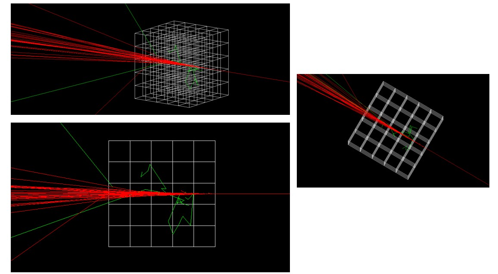

# **Final Exam: Simulation of Complex Systems**

Here you will find the files and all information related to the Geant4 simulation created by Elizabeth Granda, a Scientific Computing student, for the final exam of the Simulation of Complex Systems course in the second half of 2024. This simulation focuses on the construction of a muon detector for volcano tomography.

[Link de la presentación en Canva](https://www.canva.com/design/DAGW4CJ7gSg/CJsNtLANxw6dSrHOeNcrtg/edit?utm_content=DAGW4CJ7gSg&utm_campaign=designshare&utm_medium=link2&utm_source=sharebutton)

## **Inspiration: Why are we building a muhon detector?!**

### **Why is Volcano Tomography Important?**

Volcano tomography is crucial for understanding the internal structure and behavior of volcanoes, especially those posing significant risks to human life and infrastructure. This method provides detailed imaging of the magmatic and subsurface systems of volcanoes, offering insights into their plumbing systems, magma reservoirs, and pathways. Such knowledge is essential for predicting eruptions, planning evacuations, and mitigating disasters. For example, studies on Mt. Agung in Bali revealed critical subsurface anomalies, including magma reservoirs and dyke systems, which were used to predict volcanic activity and assess eruption risk

Additionally, volcano tomography enhances our ability to monitor changes over time, such as magma movement, which could indicate an impending eruption. These data are invaluable for regions with densely populated areas near active volcanoes, like Indonesia, where historical eruptions have caused significant casualties and economic losses

### **Why are detectors used in volcano tomography?**

Detectors, such as muon detectors, are used in volcano tomography because they offer a non-invasive way to image the interior of a volcano. Muons are subatomic particles produced in the atmosphere by cosmic rays, and they can penetrate dense materials like rock. By measuring the attenuation of muons as they pass through a volcano, scientists can create a three-dimensional map of its internal density. This method is particularly effective for identifying magma chambers, voids, and structural weaknesses within the volcanic edifice

The advantage of using muon detectors is their ability to provide continuous monitoring in real time, which complements other techniques like seismic tomography. This technology has been successfully applied to study iconic volcanoes such as Mt. Vesuvius and Mt. Asama, helping to refine eruption forecasting models.

(The information provided in those two items is from the research [*Tomographic Imaging of the Agung-Batur Volcano Complex, Bali, Indonesia, From the Ambient Seismic Noise Field*](https://www.frontiersin.org/journals/earth-science/articles/10.3389/feart.2020.00043/full) and the [*High-resolution structural imaging of volcanoes using improved muon tracking*](https://academic.oup.com/gji/article/235/2/1138/7219314)

### **What is Geant4 and why we use it for simulating detectors?**

Geant4 is a powerful simulation toolkit widely used in particle physics, nuclear physics, and medical imaging, as well as in geology and volcanology. It provides a comprehensive environment for modeling the interaction of particles with matter, making it ideal for designing and simulating muon detectors used in volcano tomography. You can read more about this incredible program in their [web page](https://geant4.web.cern.ch/)

Simulating detectors in Geant4 allows researchers to optimize their design, improve sensitivity, and accurately predict how muons will interact with volcanic structures. This ensures the reliability of the tomography results and reduces the need for expensive physical prototypes. Additionally, Geant4's ability to simulate complex geometries and physics processes is critical for understanding the unique challenges posed by the heterogeneous composition of volcanoes

---

## **Explanation of the detector and what it does**

The inspiration for the shape of this detector comes from [here](https://ep-news.web.cern.ch/content/revolutionizing-particle-detection-3d-printed-scintillating-detectors-tracking-and) where the text explains why this kind of detectors are being used a lot nowadays.

This detector consists of a 50x50 cm cube made of scintillating material. Inside this cube, there is a 5x5x5 grid of smaller cubes, also made of scintillating material. The muon source is located 10 meters away from the detector. The surrounding environment is modeled as "galactic" material, as defined in the Geant4 simulation examples. Muons are emitted towards the cube composed of smaller scintillating cubes, resulting in a simulation as shown below:

The final part of the project aimed to record the deposited energy and display it on the screen, as well as save it to a .csv file. However, this functionality was not achieved. The code snippets intended for this purpose are included, as they do not produce any errors but fail to save the data.
